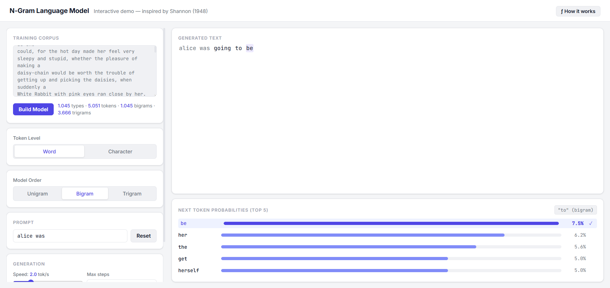
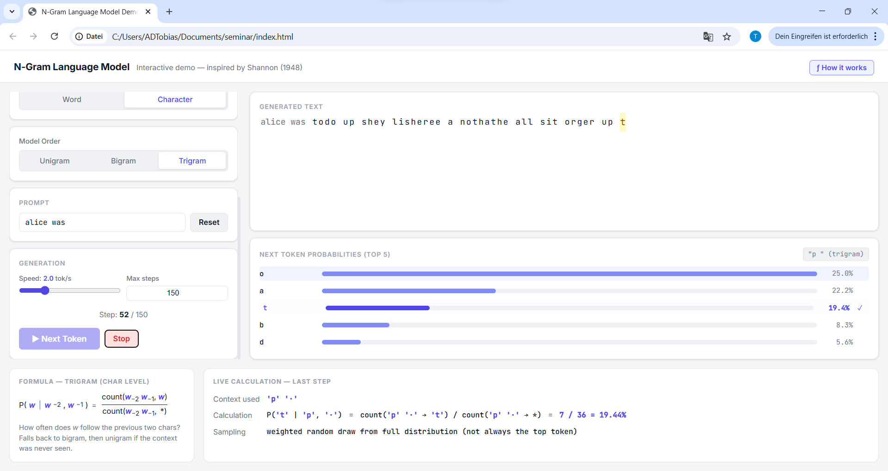

# ngramflow

An interactive web app to visualize how n-gram language models work, one token at a time.

Inspired by Claude Shannon's foundational 1948 paper *A Mathematical Theory of Communication*, **ngramflow** makes statistical language modeling tangible: train a model on any text, then watch it generate word by word (or character by character), with live probability distributions at every step.



## Features

**Step-by-step generation**
Click *Next Token* to generate one token at a time, or enable *Auto* mode for continuous generation at adjustable speed (0.2 to 8 tokens per second).

**Word-level and character-level models**
Switch between word tokens and individual characters.

**Three n-gram orders**
- **Unigram** `P(w)`: probability based on global word frequency, no context
- **Bigram** `P(w | w₋₁)`: condition on the previous token, fall back to unigram if unseen
- **Trigram** `P(w | w₋₂, w₋₁)`: condition on the previous two tokens, with graceful degradation

**Live probability visualization**
At every step, the top 5 most probable next tokens are shown with normalized probability bars. The chosen token is highlighted with its exact probability.

**"How it works" panel**
Click *f How it works* to expand a panel showing the exact mathematical formula and a live worked calculation with real corpus counts from the last step.



**Editable corpus**
Paste any text into the corpus field and rebuild the model instantly. Alice in Wonderland (Chapters I-III) is included as the default.

## Getting Started

No build step, no dependencies. Just open `index.html` in any modern browser.

```bash
git clone https://github.com/Piece-Of-Schmidt/ngramflow.git
cd ngramflow
open index.html
```

## How It Works

The model estimates conditional probabilities from raw frequency counts:

```
P(w | context) = count(context, w) / count(context, *)
```

At each step, the next token is chosen by **weighted random sampling**, not greedy argmax. Each token is selected proportionally to its probability, so generation is stochastic and varied across runs. This mirrors Shannon's original approach.

If a context was never seen in the training corpus, the model falls back gracefully: trigram to bigram, bigram to unigram. The theory panel shows when and why this happens.

## Project Structure

```
ngramflow/
├── index.html    # HTML structure
├── style.css     # Styling and animations
├── corpus.js     # Default training corpus (Alice in Wonderland, public domain)
├── model.js      # NgramModel class with full JSDoc comments
└── app.js        # UI state, rendering, event handling
```

Scripts are loaded in dependency order via `defer`: `corpus.js` then `model.js` then `app.js`.

## Educational Use

ngramflow was built for a university seminar on word embeddings and language modeling. Suggested use:

1. **Start with character-level trigrams.** The fact that (sometimes) near-readable English emerges from letter statistics alone is a powerful hook.
2. **Compare model orders.** Unigram generates noise, bigram produces fragments, trigram produces surprisingly coherent phrases (when trained on a large enaugh dataset).
3. **Open the theory panel.** Students can verify the exact probability calculation behind each generated token.
4. **Segue to neural models.** Once n-gram models are understood, it is much easier to also understand the ratio behind decoder transformer models.


---

*Corpus: Lewis Carroll, Alice's Adventures in Wonderland (1865), public domain via Project Gutenberg.*
